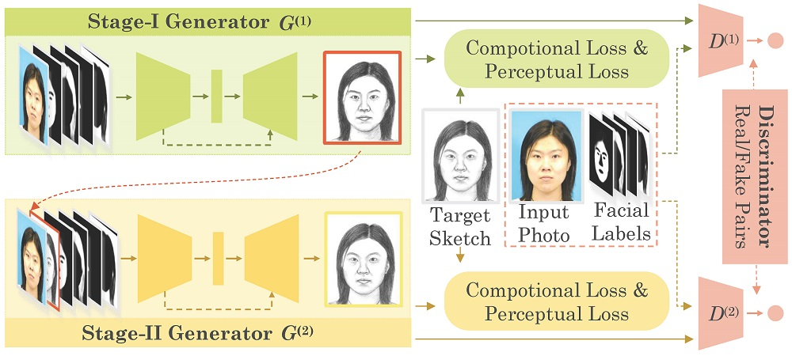

# CA-GAN

## 1. Introduction

- 人脸照片素描合成：文娱领域和刑侦领域，用于绘画机器人或身份验证
- 现有研究：浅度学习和深度学习，GAN
- 现有缺陷：结构真实性和纹理一致性上有挑战，嘴部和头发有变形和缺陷、模糊，不真实
- 方法：
  - 使用面部组成信息协助生成，能够表示强大的几何约束和复杂的结构细节，且简单不难
  - 设计组成适应的重建损失，聚焦于组成部分并防止大组件影响训练（加权）
  - 用预训练的面部识别网络构建感知损失
  - SCA-GAN，能改正缺陷并添加细节
- 结果：FID提升了，泛化能力可以，有仓库

## 2. Related Work

### 2.1 Face Photo-Sketch Synthesis

- 数据驱动的方法和模型驱动的方法
  - 前者，指用相似的训练图片进行线性组合
    - 两部分：相似图片的搜寻，线性组合权重的确定
    - 搜寻部分在测试时非常耗时间
  - 后者，指学习一个离线的图片映射函数
    - 通常关注：发掘特征、临近搜索策略、学习方法
    - 可能产生严重模型和巨大变形
- 已有方法
  - BFCN分别生成结构和纹理表示，并用面部分析结果来混淆。但严重模糊和环形效应。
  - cGAN生成再用BackProjection调整
  - CVAE和cGAN进行属性意识的合成
  - Pix2Pix和CycleGAN和多尺度判别器来生成高质量图
  - 启发式利用组成信息，学习每个组件的生成器并融合

### 2.2 Image-to-Image Translation

- 得益于GAN和VAE、尤其是cGAN，条件面部生成、文本到图片合成、图像风格迁移等很吊
- 堆叠网络取得巨大成功，如无监督图像生成、无监督图像到图像生成、文本到图像生成
- 不同之处
  - 前人只用噪声、原图片、词向量作为输入；我们用原图像及其组成信息输入
  - 前人只包含一个；我们在两个阶段的生成器包含了两个编码器，分别提取组成和外貌信息
  - 前人用全局L1所示和竞争损失；我们还用了组成L1损失和感知损失
  - 前人的一阶段网络在训练二阶段网络时固定；我们用端到端方式一起训练

## 3. Method

### 3.1 Preliminaries

- 研究的方法对素描和照片生成都适用，因为这是两个对称的过程，因此用素描生成做范例
- 问题是：给定照片X，要生成素描Y，并且2图片保有相同的特征
- 首先获得面部的结构组成M，即可以利用X和M来生成Y

### 3.2 Face Decomposition

- 假设照片为$X=H(m)*W(n)*C(d)$的，用网络将图片分为$C$个特征
  - 用P-Net，可以分为8个特征，2眼2眉1鼻1嘴唇1嘴1皮肤1头发1背景
- 假设特征为$M=H(m)*W(n)*C=\{M^1 \cdots M^C\}$
  - 该矩阵每一个元素在$[0,1]$，表示该像素属于对应特征的概率；硬标签表现不好
- 分隔网络PNet很吊，能学习高层图像语义特征，因此对素描也使用，且较精确

### 3.3 Composition-Aided GAN

- 生成器结构
  - 假设feature map为$W*H*C$
  - 对输入X和输入M使用不同的Encoder，分别为Appearance和Composition
  - 两条路线的输出在瓶颈处concat，然后送往一个Decoder
  - 总体遵循UNet，即i层和n-i层在C纬度进行concat
  - 仅用单个Encoder会导致准确率的下降和图像的模糊

- 组成损失 Compositional Loss
  - 全局重建损失 Global Reconstruction Loss
    - 即传统中在整张$m*n$图片上的逐元素的的损失
    - $L^c_{L_1,global}(Y,\hat Y)=\frac{1}{mn}||Y .* M^c-\hat Y .* M^c||_1$
    - $L_{L_1,global}(Y,\hat Y)=\frac{1}{mn}||Y-\hat Y||_1=\sum_c L^c_{L_1,global}$
    - 每个像素平等对待，大型组件会占更高的比重
  - 组成重建损失 Compositional Reconstruction Loss
    - 引入权重$\gamma_c$来平衡每个组件的重建损失，其取组件频率的倒数
    - 记$\bigotimes$为卷积，则$\gamma_c=\frac{mn}{M^c \bigotimes \vec 1}$
    - $L^c_{L_1,cmp}(Y,\hat Y)=\frac{1}{M^c \bigotimes \vec 1}||Y .* M^c-\hat Y .* M^c||_1$
    - $L_{L_1,cmp}(Y,\hat Y)=\frac{1}{M^c \bigotimes \vec 1}||Y-\hat Y||_1=\sum_c L^c_{L_1,cmp}$
    - 平衡像素差距，更关注小细节，训练更好
  - 组成损失 Compositional Loss
    - 引入权重，对全局重建损失和组成重建损失求加权平均
    - $L_{cmp}(Y,\hat Y)=\alpha L_{L_1, cmp}(Y,\hat Y) + (1-\alpha) L_{L_1, global}(Y,\hat Y)$
    - 实验中，$\alpha=0.7$，效果稍微好一些
- 感知损失 Perceptual Loss
  - 生成图片和目标图片应当具有相似的高层特征，这对人类感知质量非常关键
  - 使用预训练的人脸识别网络VGGFace的输出作为感知损失
  - $\psi^l$作为VGGFace第l层的输出，S为已选择的层
  - $L_{vggface}=\frac{1}{|S|}\sum_{l\in S} ||\psi^l(y)-\psi^l(G(x))||_2$
  - 底层信息可以让纹理相近，高层信息可以让结构和特征相似
  - 选取 conv1-1 conv5-1 conv5-3 作为输出层
- 目标函数 Objective
  - 设计竞争损失，前者为D尽量好，后者为G尽量好
  - $L_{adv}(G,D)=\mathbb{E}_{X,M,Y\sim P_{data}(X,M,Y)}[\log D(X,M,Y)]+\mathbb{E}_{X,M\sim P_{data}(X,M)}[\log 1-D(X,M,G(X,M))]$
  - $(G^*,D^*)=\arg \min_G \max_D (L_{adv}+\lambda L_{cmp}+\gamma L_{vggface})$
  - 实现中，$\lambda$和$\gamma$分别取10和5

### 3.4 Stacked Refinement Network

- 包含两个阶段的GAN，分别包含一个G和一个D，依次记为G1 D1 G2 D2
- 一阶段的GAN，接收X和M作为输入，以Y1作为初始输出
- 二阶段的GAN，接收X和Y1和M作为输入，以Y2作为优化输出
- X和Y1进行concat后输入G2的Appearance Encoder

### 3.5 Network Architecture

- 所有照片和素描都是RGB形式
- 遵循cGAN的模块命名方式：
  - Ci/j 表示Convolution-InstanceNorm-LeakyReLU，输入i通道，输出j通道
  - TCi/j 表示TransposedConvolution-InstanceNorm-ReLU，输入i通道，输出j通道
  - 所有卷积都是4x4的kernel，2的stride
- SCA-GAN的网络结构组成
  - Encoder：Cc/64 C64/128 C128/256 C512/512 C512/512 C512/512 C512/512
    - 针对$E_a^1$ $E_c^1$ $E_a^2$ $E_a^2$，c分别为3 8 6 8 
    - 第一层没有使用InstanceNorm
  - Decoder：TC1024/512 TC1536/512 TC1536/512 TC1536/512 TC1535/256 TC768/128 TC384/64 TC192/3
    - 最后一层使用Tanh函数
  - Discriminator：Cl/64 C64/128 C128/256 C256/512 C512/1
    - 针对$D^1$ $D^2$，l分别是14(3+3+8) 17(3+3+8+3)
    - 最后一层使用Sigmooiod函数
  - 普遍使用0.2斜率的LeakyReLU

### 3.6 Optimization

- 在优化过程中，交替在D和G上进行梯度下降
- 使用minibatch-SGD和Adam-solver

## 4. Experiments

### 4.1 Settings

- 数据集：
  - CUFS：606=188+123+295；268=88+80+100
  - CUFSF：1194 hard；250+944
  - 预处理：用两眼中心的嘴巴中心校准图片，裁剪为250x200（可用MTCNN）
  - 将原图片用zero-padding而非resize规范到256x256
- 评判标准
  - Frechet Inception distance (FID)
    - 用于评估生成样本和真实样本分布的Earth-Mover Distance (EMD)
    - 使用在ImageNet上预训练的Inception-v3网络的2048维特征
    - 广泛使用，和人类认知高度一致，其值越低说明分布越接近
  - Feature Similarity Index Metric (FSIM)
    - 在生成图像和其对应的真实图像之间，评估生成的质量
    - Phase Congruency (PC) 和图像 Gradient Magnitude (GM) 作为特征
    - 测试图像和其对应的参考图像之间的特征相似性作为质量索引
    - 尽管在自然图片中衡量较好，但合成上和人类认知不太一致
  - Null-space Linear Discriminant Analysis (NLDA)
    - 将真实图片作为检测图片，合成图片作为库中图片，进行人脸识别
    - 重复人脸识别实验20次，随机划分数据，记录平均准确率
  - 如下设计实验
    - 首先，在CUFS上进行消融实验
    - 其次，在CUFS和CUFSF上进行合成，和已有模型比较
    - 然后，在野生人脸上进行实验，检验方法对光照和姿势是否健壮
    - 最后，证明使用的技术加速并稳定了训练过程

### 4.2 Ablation Study

- 主要检验5个决策的可行性
  - 使用zero-padding而非resizing
  - 使用面部组成M作为辅助输入
  - 组成损失$L_{cmp}$
  - 感知损失$L_{vggface}$
  - 堆叠精炼stack
- 具体不细说了，看文章

### 4.3 Face Sketch Systhesis

- 与已有的先进方法进行比较：
  - MRF，MWF，SSD，MrFSPS，RSLCR，MRNF，BFCN，DGFL，BP-GAN，cGAN
  - 已有方法的生成图片已被作者放在[这网站开梯子都上不去](http://www.ihitworld.com/)
  - 新的近期作品不再比较，因实验设计很特殊，且动机不同
- 牛逼之处：
  - FID贼高，比其他的都高不少
  - FSIM和NLDA都能匹敌，而且FSIM是用于衡量照片的质量缺陷，而非素描的观感质量
  - 比较一下图片，看看模糊、变形、材质、阴影啥的

### 4.4 Face Photo Synthesis

- 很少有网络做这个，因此比较一个先进方法：MrFSPS，cGAN（被吊打）
- 比较几张图，不模糊、质量高、很自然

### 4.5 Robustness Evaluation

- 验证模型的泛化性能，将CUFS上训练的模型应用到野生人脸上
  - 光照和姿势变化
  - 国际名人的照片/素材生成

### 4.6 Analysis of the Training Procedure

- 在CUFS上分析cGAN，CAGAN和SCACGAN的训练过程
- 每个epoch在训练集和测试集上计算重建误差(全局L1损失)
- cGAN的损失曲线波动较大，CAGAN的损失下降较快
- 说明加速并稳定了训练

### 4.7 Summary

- 模型能够生成视觉真实且保有特征的素描和照片，特别是显著降低了FID
- 使用面部组成信息作为辅助输入，用组合损失来提高了效果
- 感知损失显著提高了照片生成质量，但对素描生成帮助不大
- 堆叠CAGAN可以提升合成图片的质量
- 加速并稳定了训练
- CAGAN和SCAGAN提高了泛化能力，野生人脸很有挑战

## 5. Conclusion

- 不摆了
